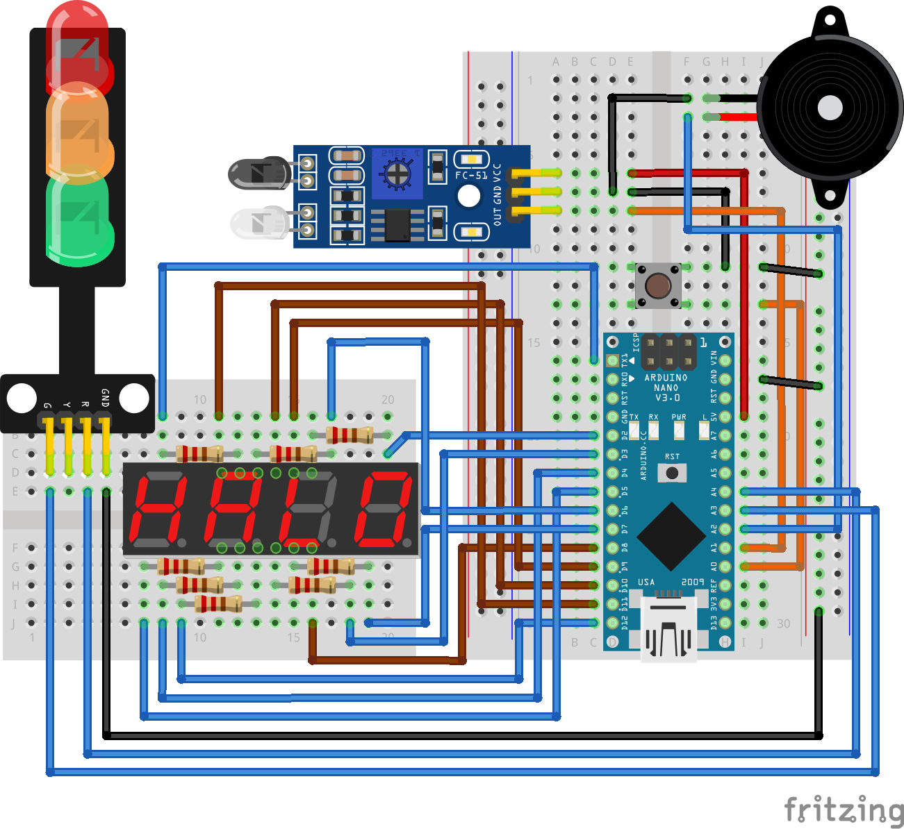

## Circuit



More horrible wiring. I hope this is understandable enough.

## Code

```cpp
void display_segmen(int A, int B) {
  uint8_t angka[10] = { 0x7e, 0x0c, 0xb6, 0x9e, 0xcc, 0xda, 0xfa, 0x0e, 0xfe, 0xde };

  PORTB = 0x0e;
  PORTD = angka[A / 10 % 10];
  PORTB &= ~(1 << PB4);
  _delay_ms(5);

  PORTB = 0x0d;
  PORTD = angka[A % 10];
  PORTB |= (1 << PB4);
  _delay_ms(5);

  PORTB = 0x0b;
  PORTD = angka[B / 10 % 10];
  PORTB &= ~(1 << PB4);
  _delay_ms(5);

  PORTB = 0x07;
  PORTD = angka[B % 10];
  PORTB &= ~(1 << PB4);
  _delay_ms(5);
}

int main() {
  DDRD = 0xfe;
  DDRB = 0x1f;
  DDRC &= ~(1 << PC0) | ~(1 << PC1);
  DDRC |= (1 << PC2) | (1 << PC3) | (1 << PC4);
  PORTC |= (1 << PC0) | (1 << PC1);

  int i = 0;
  int waktu = 0;

  bool pb, last_pb;
  bool ir, last_ir;
  bool buzz = false;

  int timA = 0;
  int timB = 0;

  while (1) {
    pb = !(PINC & (1 << PC0));
    ir = !(PINC & (1 << PC1));

    if (ir && !last_ir) {
      timB += 3;
      buzz = true;
    }
    last_ir = ir;

    if (pb && !last_pb) {
      timA += 3;
      buzz = true;
    }
    last_pb = pb;

    if (buzz) PORTC |= (1 << PC2);
    else PORTC &= ~(1 << PC2);

    waktu++;
    if (waktu == 3) {
      waktu = 0;
      if (buzz) {
        buzz = false;
      }
    }

    if (timA >= 99 || timB >= 99) {
      PORTC |= (1 << PC3);
      PORTC &= ~(1 << PC4);
    } else {
      PORTC &= ~(1 << PC3);
      PORTC |= (1 << PC4);
    }

    if (timA >= 99) { timA = 99; }
    if (timB >= 99) { timB = 99; }


    display_segmen(timA, timB);
  }

  return 0;
}

```
