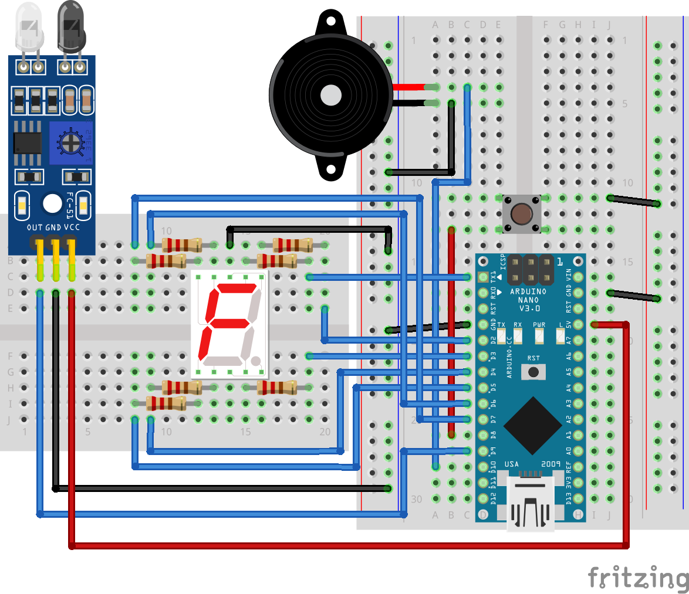

## What is this?

Just my uni assignment for microcontroller course. Idk where else I should put this tbh.

Just realized I could just put this whole thing in github smh. Oh well whatever ig.

## Circuit



Horrible, horrible wiring. I hope this is understandable enough.

## Code

```cpp
int main() {
  DDRD = 0xfe;
  DDRB &= ~(1 << PB0) | ~(1 << PB1);
  DDRB |= (1 << PB2);
  PORTB |= (1 << PB0) | (1 << PB1);

  byte angka[16] = { 0x7e, 0x0c, 0xb6, 0x9e, 0xcc, 0xda, 0xfa, 0x0e, 0xfe, 0xde };
  byte i = 0;

  bool ir, last_ir;
  bool pb, last_pb;

  while (1) {
    ir = !(PINB & (1 << PB1));
    pb = !(PINB & (1 << PB0));

    if (ir && !last_ir) {
      PORTB |= (1 << PB2);
      _delay_ms(100);
      PORTB &= ~(1 << PB2);
      i = (i + 1) % 10;
    };
    last_ir = ir;
    _delay_ms(100);

    if (!pb && last_pb) {
      PORTB |= (1 << PB2);
      _delay_ms(100);
      PORTB &= ~(1 << PB2);
      i = (i + 10 - 1) % 10;
    };
    last_pb = pb;
    _delay_ms(100);

    PORTD = angka[i];
  }

  return 0;
}

```
